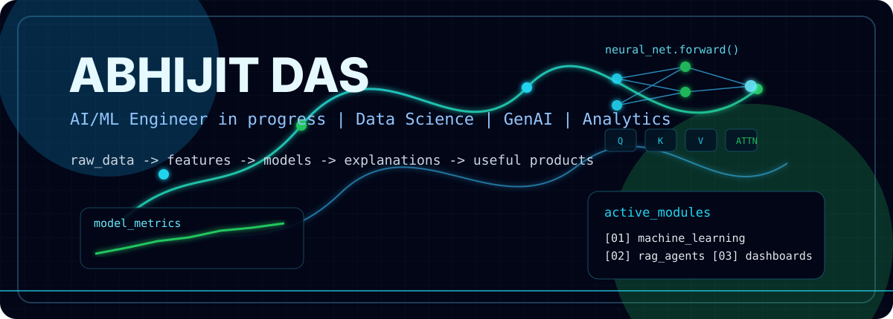
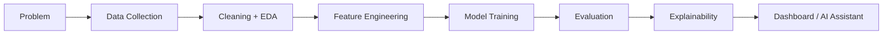

<div align="center">



[](https://git.io/typing-svg)

<p>
  <a href="https://github.com/alligatord788-dot"></a>
  <a href="https://linkedin.com/in/abhijit-das-a9b517239"></a>
  <a href="mailto:abhijitdasd788@gmail.com"></a>
  
</p>

</div>

---

<table>
  <tr>
    <td width="55%">
      <h2>~/profile</h2>
      <p>
        I am <b>Abhijit Das</b>, a B.Tech Chemical Engineering student at <b>IIT Delhi</b>,
        building projects across <b>AI/ML, Data Science, GenAI and Analytics</b>.
      </p>
      <p>
        I like full workflows: raw data -> cleaning -> features -> model -> evaluation ->
        explanation -> dashboard or assistant.
      </p>
    </td>
    <td width="45%">
      <h2>~/current_focus</h2>
      <ul>
        <li>Applied machine learning and model evaluation</li>
        <li>Explainable dashboards for business decisions</li>
        <li>RAG assistants using LangChain and FAISS</li>
        <li>Deep learning and transformer-based workflows</li>
      </ul>
    </td>
  </tr>
</table>

```txt
status      : building AI/ML + GenAI projects
base        : IIT Delhi
stack       : Python, SQL, C++, Scikit-learn, XGBoost, PyTorch, LangChain, Streamlit
style       : simple code, clean pipelines, explainable outputs
```

---

##  Tools I Work With

<p align="center">
  
</p>

<table>
  <tr>
    <td><b>ML / Analytics</b></td>
    <td>NumPy, Pandas, Scikit-learn, XGBoost, Matplotlib, Seaborn, Plotly</td>
  </tr>
  <tr>
    <td><b>GenAI / RAG</b></td>
    <td>LangChain, OpenAI API, FAISS, PyPDF, BeautifulSoup, Chainlit</td>
  </tr>
  <tr>
    <td><b>Apps / Platforms</b></td>
    <td>Streamlit, Kaggle, Jupyter, Docker, GitHub, Microsoft Azure, Lightning AI</td>
  </tr>
  <tr>
    <td><b>Core CS</b></td>
    <td>C++, recursion, DFS, backtracking, hashing, two pointers, clean project structure</td>
  </tr>
</table>

---

##  Featured Builds

<table>
  <tr>
    <td width="50%">
      <h3>01. Financial AI Research Assistant</h3>
      <p>RAG assistant that reads PDFs, scrapes URLs and answers finance research questions with source-grounded context.</p>
      <p><code>LangChain</code> <code>FAISS</code> <code>OpenAI</code> <code>BeautifulSoup</code> <code>Chainlit</code></p>
      <a href="https://github.com/alligatord788-dot/financial_ai_research_assistant">Repository</a>
    </td>
    <td width="50%">
      <h3>02. Credit Risk Scoring Dashboard</h3>
      <p>Credit-risk system with default probability, risk score, risk bands, threshold logic and applicant explainability.</p>
      <p><code>Scikit-learn</code> <code>Streamlit</code> <code>Plotly</code> <code>Finance Analytics</code></p>
      <a href="https://github.com/alligatord788-dot/credit_risk_scoring_explainability_dashboard">Repository</a>
    </td>
  </tr>
  <tr>
    <td width="50%">
      <h3>03. Digital Subscription Churn Analytics</h3>
      <p>Churn prediction and retention analytics system with XGBoost tuning, revenue-at-risk and action planning.</p>
      <p><code>XGBoost</code> <code>GridSearchCV</code> <code>Streamlit</code> <code>Plotly</code></p>
      <a href="https://github.com/alligatord788-dot/customer_churn_analytics_retention_prediction">Repository</a>
    </td>
    <td width="50%">
      <h3>04. HCC In Silico Perturbation</h3>
      <p>Applied deep-learning workflow using transformer embeddings and gene perturbation analysis on HCC data.</p>
      <p><code>Geneformer</code> <code>CellOracle</code> <code>Docker</code> <code>PyTorch</code> <code>AnnData</code></p>
      <a href="https://github.com/alligatord788-dot/hcc-insilico-perturbation_ABHIJIT">Repository</a>
    </td>
  </tr>
</table>

---

##  How I Build



```txt
For ML projects      : metrics, thresholds, leakage checks, feature importance
For analytics        : insights, segments, revenue/risk impact, visual dashboards
For GenAI projects   : document loading, chunking, embeddings, retrieval, final answer
For DSA projects     : simple C++ logic, recursion, DFS, hashing and clean functions
```

---

##  GitHub Activity

<div align="center">


<br/><br/>


</div>

> If a stats card does not load, it is usually an external image service rate-limit/cache issue. The rest of the profile is local and stable.

---

##  Build Philosophy

```txt
The model is not the final product.
The final product is a decision, dashboard, assistant, ranking, explanation or workflow
that helps someone act faster and with more confidence.
```

<div align="center">


</div>
